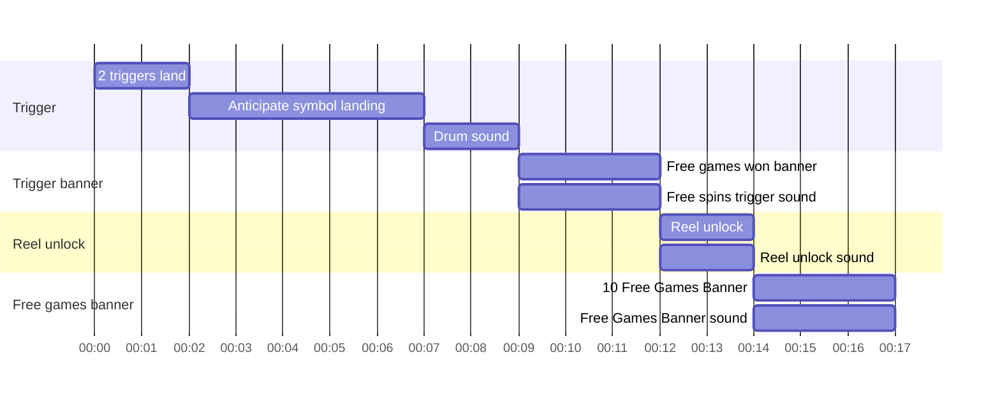
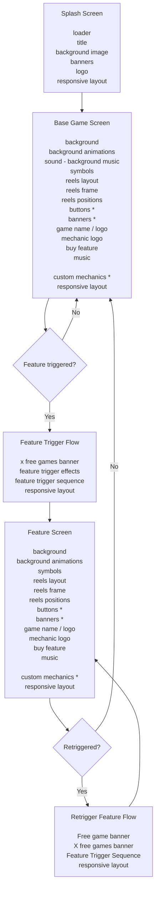

## Game Sounds

| SFX Name | Version | Implementation |
|---|---|---|
| anticipation.mp3 | | Reel landing anticipation |
| base_bgm_01.mp3 | | 3-5 rows active |
| base_bgm_02.mp3 | | 6-9 rows active |
| base_bgm_03.mp3 | | 10-12 rows active |
| base_bgm_04.mp3 | | 12+ rows active |
| bigwin_1_2.mp3 | | 1 of 2 random big win |
| bigwin_3_4.mp3 | | 1 of 2 random big win |
| button.mp3 | | default button click |
| fs_bgm.mp3 | | free spins background music |
| fs_trigger.mp3 | | free spins trigger music |
| fs_wait.mp3 | | free spins after trigger banner wait |
| gong.mp3 | | play after triggering feature symbol |
| ... | | |

## Feature Trigger Flow

